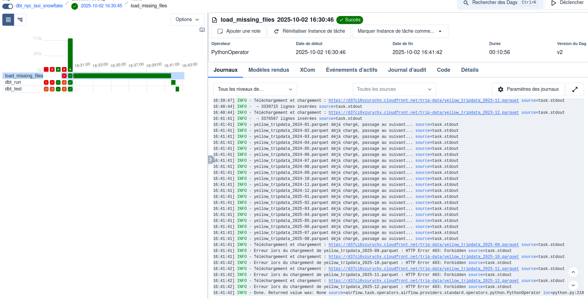

# brief_dbt_snowflake
## NYC Taxi Data Loader

This Python project automates the loading of New York City Yellow Taxi trip data into a Snowflake database. It downloads Parquet files from CloudFront, transforms them, and inserts them into Snowflake for downstream analysis.

### Table of Contents

- [Prerequisites](#prerequisites)
- [Installation](#installation)
- [Configuration](#configuration)
- [Usage](#usage)
- [Project Structure](#project-structure)
- [Features](#features)

#### Prerequisites

Python 3.10 or higher
Snowflake account with permissions to create:
- Warehouses
- Databases
- Schemas
- Tables

Docker (for running Astronomer/Airflow locally)

Astronomer CLI (for local development and orchestration)
  - Install via [Astronomer Docs](https://www.astronomer.io/docs/cloud/stable/get-started/quickstart/)
  - Verify installation:
    ```bash
    astro version
    ```
- Git (to clone the repository)

#### Installation

1. Clone the repository:
    ```bash
    git clone https://github.com/your-username/nyc-taxi-loader.git
    cd nyc-taxi-loader
    ```
2. (Optional) Create a virtual environment:
    ```python
    python -m venv venv
    source venv/bin/activate  # Linux/Mac
    venv\Scripts\activate
    ```
3. Install dependencies:
    ```python 
    pip install -r requirements.txt
    ```

#### Configuration
1. Create a .env file in the project root with your Snowflake credentials:
    ```env
    SNOWFLAKE_USER=<your_user>
    SNOWFLAKE_PASSWORD=<your_password>
    SNOWFLAKE_ACCOUNT=<your_account>
    ```
2. Ensure your Snowflake account has the required privileges to create warehouses, databases, schemas, and tables.
Exemple user :
```sql
USE ROLE ACCOUNTADMIN;

-- Créer le rôle import_data
CREATE ROLE IF NOT EXISTS import_data;

-- Créer l'utilisateur DBT
CREATE USER IF NOT EXISTS import_data_user
  PASSWORD='MotDePasseDBT123@'
  LOGIN_NAME='import_data_user'
  MUST_CHANGE_PASSWORD=FALSE
  DEFAULT_ROLE='import_data'
  COMMENT='Utilisateur pour importer les données dans RAW';

-- Assigner le rôle
GRANT ROLE ACCOUNTADMIN TO USER import_data_user;
GRANT ROLE import_data TO USER import_data_user;
```


#### Usage
##### Initialization snowflake
Run the main script to load data:
```bash
python init_snowflake.py
```

The script performs the following steps:

1. Connects to Snowflake
2. Creates the warehouse NYC_TAXI_WH if it doesn't exist
3. Creates the database NYC_TAXI_DB and schemas RAW, STAGING, and FINAL
4. Creates the table RAW.YELLOW_TRIPDATA
5. Downloads and loads Parquet files for 2024 and 2025
6. Prints the number of rows inserted for each file

##### DBT Core Usage
The project includes a nyc_taxi_dbt folder for transformations, testing, and analysis with dbt.
1. Setup
    Navigate to the dbt directory:
    ```sh
    cd nyc_taxi_dbt
    ```
    Configure your Snowflake profile (~/.dbt/profiles.yml):
    ```yml
    nyc_taxi:
    target: dev
    outputs:
        dev:
        type: snowflake
        account: <your_account>
        user: <your_user>
        password: <your_password>
        role: import_data
        warehouse: NYC_TAXI_WH
        database: NYC_TAXI_DB
        schema: RAW
        threads: 4

    ```
2. Common dbt Commands

    - Run all models:
    ```sh
    dbt run
    ```

    - Run the full pipeline (models + tests + snapshots + seeds):
    ```sh
    dbt build
    ```

    - Test models:
    ```sh
    dbt run
    ```

    - Generate and serve documentation::
    ```sh
    dbt docs generate
    dbt docs serve
    ```

    - Run a specific model:
    ```sh
    dbt run --select staging.yellow_tripdata
    ```
    Models are organized into staging and final folders to separate raw ingestion from final transformations.

##### Airflow Orchestration

All DAGs and Airflow-related configurations are located in the orchestration/ folder. This ensures that the ETL and dbt processes are modular and separated from the raw ingestion and transformation code.
1. Folder Structure
```
orchestration/
├── airflow_settings.yaml
├── dags
├── Dockerfile
├── include
├── nyc_taxi_dbt
├── packages.txt
├── plugins
├── README.md
├── requirements.txt
└── tests
```
2. Environment Variables

Create a .env file in the orchestration/ folder (ignored in GitHub) with your Snowflake credentials:
```
SNOWFLAKE_ACCOUNT=your_SNOWFLAKE_ACCOUNT
SNOWFLAKE_USER=your_SNOWFLAKE_USER
SNOWFLAKE_PASSWORD=your_SNOWFLAKE_PASSWORD
DBT_USER=your_DBT_USER
DBT_PASSWORD=your_DBT_PASSWORD
SNOWFLAKE_ROLE=your_SNOWFLAKE_ROLE
SNOWFLAKE_DATABASE=your_SNOWFLAKE_DATABASE
SNOWFLAKE_WAREHOUSE=your_SNOWFLAKE_WAREHOUSE
SNOWFLAKE_SCHEMA=your_SNOWFLAKE_SCHEMA
```
3. Run the DAG
- Navigate to the orchestration/ folder:
```
cd orchestration/
```
- Start Airflow / Astronomer:
```
astro dev start
```
- Trigger the DAG from the Airflow UI or wait for the schedule.

- Below is an example DAG for loading NYC Yellow Taxi data and running dbt transformations:



- `load_missing_files` → loads missing Parquet files into Snowflake
- `dbt_run` → runs all dbt models
- `dbt_test` → runs dbt tests after ingestion


#### Project Structure
```
nyc-taxi-loader/
├── analyse_av_nettoyage.sql
├── init_snowflake.py
├── instruction.md
├── orchestration
│   ├── airflow_settings.yaml
│   ├── dags
│   ├── Dockerfile
│   ├── include
│   ├── nyc_taxi_dbt
│   ├── packages.txt
│   ├── plugins
│   ├── README.md
│   ├── requirements.txt
│   └── tests
├── nyc_taxi_dbt
│   ├── analyses
│   ├── dbt_project.yml
│   ├── macros
│   │   └── generate_schema_name.sql
│   ├── models
│   │   ├── final
│   │   └── staging
│   ├── package-lock.yml
│   ├── packages.yml
│   ├── seeds
│   ├── snapshots
│   ├── target
│   └── tests
├── README.md
└── requirements.txt
```

#### Features

- Automatic download of NYC Yellow Taxi Parquet files from CloudFront
- Datetime transformation to Snowflake-compatible format
- Adds source file name column
- Loads data into Snowflake using write_pandas
- Handles errors for individual files
- DBT Core support for transformations, tests, and analyses
